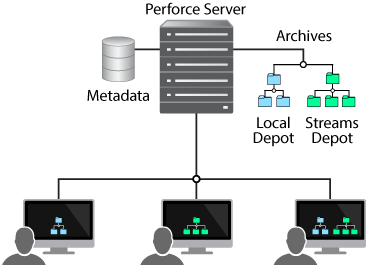
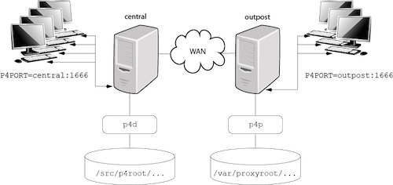

# Perforce Helix

#### Table of Contents

1. [Overview](#overview)
1. [Module Description - What the module does and why it is useful](#module-description)
1. [Usage - Configuration options and additional functionality](#usage)
1. [Limitations - OS compatibility, etc.](#limitations)

## Overview

This module is used to manage various Perforce Helix components that are available as Linux packages.

## Module Description

Helix is a version management system that incorporates a combination of services. 

[Introduction to Perforce Helix](http://www.perforce.com/perforce/r15.2/manuals/intro)

Specifically, this module manages the command-line tool (p4), server (p4d), broker (p4broker) and proxy (p4p). Detailed administration information for these components can be found in the online guides below:

* [Helix Administration Guide](https://www.perforce.com/perforce/doc.current/manuals/p4sag/index.html)
* [Helix Multi-Site Deployment Guide](https://www.perforce.com/perforce/doc.current/manuals/p4dist/index.html)

## Usage

### Classes
#### helix::client

The simplest way to get the helix client installed is by including the class:

`include helix::client`

The class does provide a `pkgname` parameter that can be used to change the package that will be installed.

~~~
class { 'helix::client':
  pkgname => 'helix-cli',
}
~~~

The p4 executable is installed at `/opt/perforce/bin/p4`. For convenience, a symbolic link is created to make p4 available on everyone's path: `/usr/bin/p4 -> /opt/perforce/bin/p4`

#### helix::server

The simplest way to get the helix server installed is by including the class:

`include helix::server`

The class does provide a `pkgname` parameter that can be used to change the package that will be installed.

~~~
class { 'helix::server':
  pkgname => 'helix-p4d',
}
~~~

#### helix::broker

The simplest way to get the helix broker installed is by including the class:

`include helix::broker`

The class does provide a `pkgname` parameter that can be used to change the package that will be installed.

~~~
class { 'helix::server':
  pkgname => 'helix-broker',
}
~~~

#### helix::proxy

The simplest way to get the helix proxy installed is by including the class:

`include helix::proxy`

The class does provide a `pkgname` parameter that can be used to change the package that will be installed.

~~~
class { 'helix::proxy':
  pkgname => 'helix-proxy',
}
~~~

### Defined Types

#### helix::server_instance
A p4d instance can be configured using the `helix::server_instance` type.

At a minimum, the p4port must be specified.

Before declaring a `helix::server_instance`, ensure that you include the helix::server base class (this will make sure the relevant packages are installed).

~~~
include helix::server

helix::server_instance { 'server1':
  p4port => '1666',
}
~~~

The following attributes are supported:

* p4port (required) - the port for the server. This should be in P4PORT format **protocol:hostname:port**, for example `ssl::1666`
* p4root (default /opt/perforce/servers/${title}/root) - location for the metadata databases
* p4depots (default /opt/perforce/servers/${title}/depots) - location for the depot root
* p4log (default /var/log/perforce/${title}_server.log) - location of the server log file
* p4journal (default /opt/perforce/servers/${title}/checkpoints/journal) - location of the journal file
* p4ssl (default /opt/perforce/servers/${title}/ssl) - directory that contains the ssl certificate and key
* osuser (default perforce) - user owner of the server
* osgroup (default perforce) - group owner of the server
* ensure (default running) - state of the service [running, stopped]
* enabled (default true) - flag indicating whether or not the service should be enabled

#### helix::broker_instance
A p4broker instance can be configured using the `helix::broker_instance` type.

At a minimum, the p4brokerport and p4brokertarget parameters must be specified.

Before declaring a `helix::broker_instance`, ensure that you include the helix::broker base class (this will make sure the relevant packages are installed).

~~~
include helix::broker

helix::broker_instance { 'broker1':
  p4brokerport   => '1667',
  p4brokertarget => 'perforce:1666',
}
~~~

The following attributes are supported:

* p4brokerport (required) - listen port for the broker. This should be in P4PORT format **protocol:hostname:port**, for example `ssl::1666`
* p4brokertarget (required) - target port -- the port of the p4d -- that the broker will use. This should be in P4PORT format **protocol:hostname:port**, for example `perforce:1666`
* directory (default /opt/perforce/servers/${title}) - directory that will contain the broker configuration file
* p4ssl (default /opt/perforce/servers/${title}/ssl) - directory that contains the ssl certificate and key
* logfile (default /var/log/perforce/${title}_broker.log) - location of the log file for the server
* debuglevel (default 1) - level of logging information (1-3)
* adminname (default Perforce Admins) - administrator's name (used for information purposes)
* adminphone (default 999/911) - administrator's phone (used for information purposes)
* adminemail (default perforce-admins@example.com) - administrator's email (used for information purposes)
* serviceuser (default undef) - service user perforce account name
* ticketfile (default undef) - location of the ticketfile
* redirection (default selective) - redirection mode to use -- selective or pedantic.
* commands (default []) - an array of commands to intercept
* osuser (default perforce) - user owner of the server
* osgroup (default perforce) - group owner of the server
* ensure (default running) - state of the service [running, stopped]
* enabled (default true) - flag indicating whether or not the service should be enabled

#### helix::proxy_instance
A p4proxy instance can be configured using the `helix::proxy_instance` type.

At a minimum, the p4proxyport and p4proxytarget parameters must be specified.

Before declaring a `helix::proxy_instance`, ensure that you include the helix::proxy base class (this will make sure the relevant packages are installed).

~~~
include helix::proxy

helix::proxy_instance { 'proxy1':
  p4proxyport   => '1666',
  p4proxytarget => 'perforce:1666',
}
~~~

The following attributes are supported:

* p4proxyport (required) - listen port for the broker. This should be in P4PORT format
* p4proxytarget (required) - listen port for the broker. This should be in P4PORT format
* cachedir (default /opt/perforce/servers/${title}/cache) - directory where depot files will be cached
* p4ssl (default /opt/perforce/servers/${title}/ssl) - directory that contains the ssl certificate and key
* logfile (default /var/log/perforce/${title}_proxy.log) - location of the log file for the server
* osuser (default perforce) - user owner of the server
* osgroup (default perforce) - group owner of the server
* ensure (default running) - state of the service [running, stopped]
* enabled (default true) - flag indicating whether or not the service should be enabled

## Limitations

This module is only supported on Linux (RedHat and Ubuntu), as those are the
only packages available from the Perforce Helix distribution.
